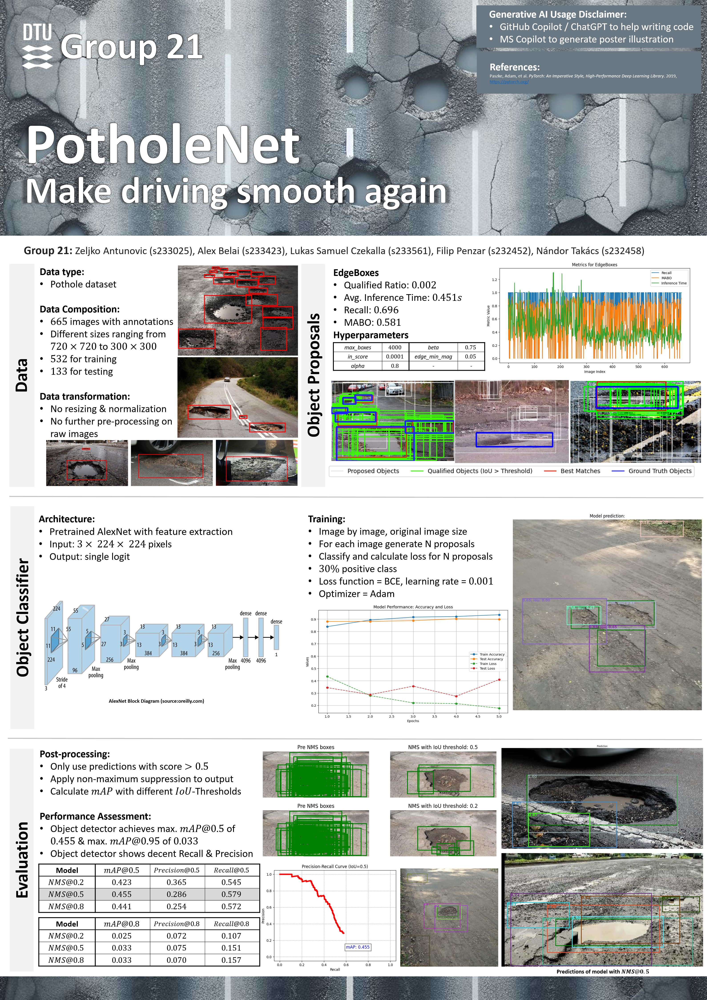
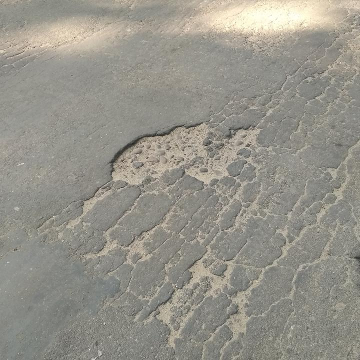

# 02516_IDLCV_Project_03

## Project Description

This project aims at implementing an object detection network based on the Potholes dataset. The project has multiple parts which are:

- Generating feature proposals
- Classifying proposed regions using classification network
- possibly even more :)

## Data

The pothole dataset consists of 665 images with pothole annotations in the form of bounding boxes. The annotations are stored in an XML PascalVOC-style format.



## Run training on the HPC

To start training using batch jobs first modify the jobscript.sh file you want to use. Please note that every contributor is recommended to create his own jobscript_[NAME].sh file according to his preferences.

Then execute:

```bash
bsub -app c02516_1g.10gb < jobscript_[NAME].sh
```

To monitor the progress execute:
```bash
bstat
```

To abort the run:

```bash
bkill <job-id>
```

## Submission Deadline

Submission on Tuesday 19.11.2024 at 22:00.


